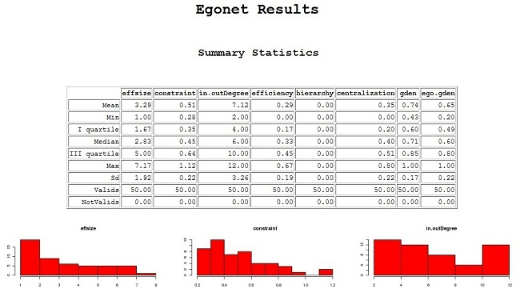

# egonet
A small for Social Network Analysis, dealing with egocentric network measures, including Burt's effective size and aggregate constraint and an import code suitable for a large number of adjacency matrices.

